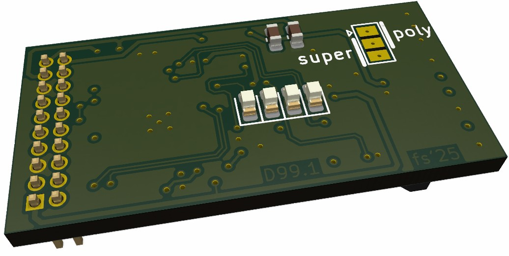
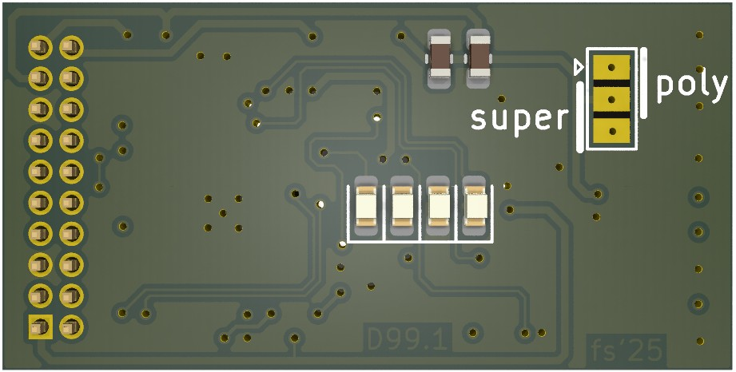
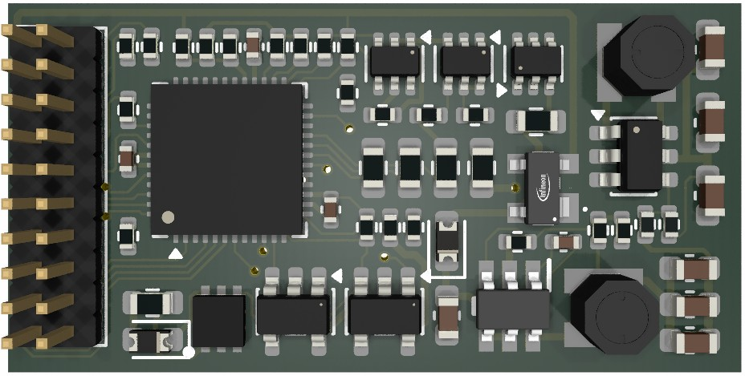
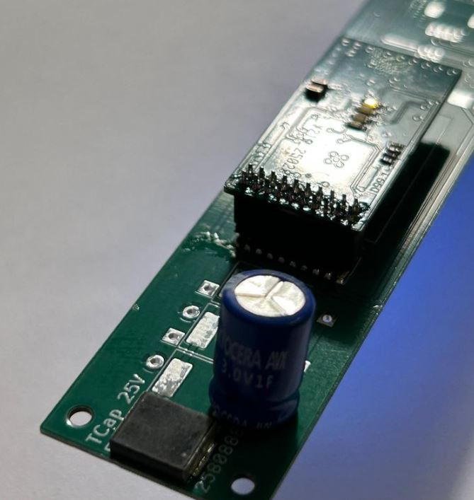
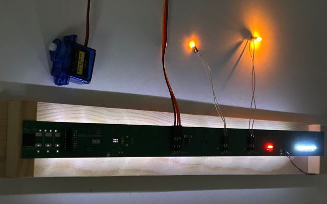

# RTB_D99

My Homebrew D99 decoder core is designed to drive various custom made LED strips. The core can address up to 32 individual LEDs.

User Guides

- User Guide - DE
- [User Guide - EN](https://rtb4dcc.de/rtb_decoder_reference_en/)

 

## Decoder features
- **DCC**
  - DCC-A automatic logon
  - DCC-R protocol extension
  - Service Mode Programming
- **Railcom**
  - Channel 1/2
  - POM, xPOM
  - DYN: QoS, Track-Voltage, Scap-Voltage, Temp, Ambient light
- 2.8V SCAP (external to PCB)
- 16V Polymer Caps (external to PCB)
- Inrush limited
- max track voltage 25V
- up to 32 individual LEDs
- CPU heartbeat LED
- ambient light sensor (optional)
- fast firmware update within seconds on main tracks via DCC-R

# Hardware
The current PCB layout uses SMD footprints with 0.4mm pitch and mainly 0402 parts. Reflow soldering is mandatory.
The layout has been optimized to automatic PCB assembly.

## PCB
- 4-layer PCB, FR4, 1mm
- CPU: AVR64DA48

## Kicad
[Schematic](doc/D99_schematic.pdf) | [Layout](doc/D99_layout.pdf) | [Gerber](gerber)

Dependency

 

:yellow_circle: Requires my Kicad project library [RTB_SamacSys](https://github.com/git4dcc/RTB_SamacSys) in the same directory tree.

## Firmware
Filename structure: { **pcb** }{ **code** }{ **version** }.hex

Example: **D13F0001**.hex

|   | Description |
| --- | --- |
| **pcb** | Name of matching hardware (**D13**) |
| **code** | Type of code contained (**R**=rom, **B**=bootloader, **F**=flash, **U**=bld update, **P**=UPDI factory code) |
| **version** | Release version (**####**) |

# Images
 

# YouTube
See the D13 decoder in action.  

This project is intended for hobby use only and is distributed in accordance with the Apache License 2.0 agreement.
