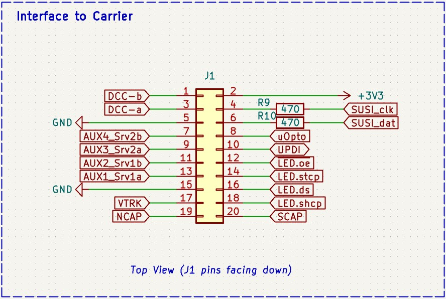

# RTB_D99

My Homebrew RTB D99 is an advanced, open-source decoder core (AVR64DA48) designed for serious modelers. It provides individual, high-density control for up to 32 LEDs and 4 auxiliary ports. More than just control, this core is engineered for ultimate reliability:
- **Flicker-Free Power:** Includes charging logic for external Polymer or Supercapacitors for robust power backup.
- **Real-Time Diagnostics:** Harness the power of Railcom DYN to transmit vital data, including Quality of Service (QoS), track voltage, and temperature, back to your central station.
- **DIY High-Density:** Fully open-source KiCad design (4-layer PCB) ready for reflow assembly.

LED base
- [Roco #44741](ledbase/Roco_44741)

 

> [!CAUTION]
> This project is **work in progress** and there may be (hope not) changes to the overall design if the current turns out to be not practical.

 

User Guides

- User Guide - DE
- [User Guide - EN](https://rtb4dcc.de/rtb_decoder_reference_en/)

 

## Decoder features
- **DCC**
  - DCC-A automatic logon
  - DCC-R protocol extension
  - Service Mode Programming
- **Railcom**
  - Channel 1/2
  - POM, xPOM
  - DYN: QoS, Track-Voltage, Scap-Voltage, Temp, Ambient light
- **AUX ports**
  - 4 AUX ports (3.3V logic level)
  - AUX ports my be used for Servo
- **LED ports**
  - designed for 74HC595 shift register usage
  - allows up to 32 individual LEDs
- SUSI 3.3V
- 2.8V SCAP (optional, external to PCB)
- 16V Polymer Caps (optional, external to PCB)
- Inrush limited
- max track voltage 25V
- CPU heartbeat LED
- ambient light sensor (optional)
- fast firmware update within seconds on main tracks via DCC-R

# Hardware
The current PCB layout uses SMD footprints with 0.4mm pitch and mainly 0402 parts. Reflow soldering is mandatory.
The layout has been optimized to automatic PCB assembly.

| top | bottom |
| --- | --- |
|  |  |

## PCB
- 4-layer PCB, FR4, 1mm
- CPU: AVR64DA48

Details

 

  

| pin | label | direction | description |
| --- | --- | --- | --- |
| 1 | DCC-b | input | DCC signal from track |
| 3 | DCC-1 | input | DCC signal from track |
| 5 | GND | output | Decoder ground signal (after rectifier) |
| 7 | AUX-4 | output | Logic level auxiliary port (3.3V) |
| 9 | AUX-3 | output | Logic level auxiliary port (3.3V) |
| 11 | AUX-2 | output | Logic level auxiliary port (3.3V) |
| 13 | AUX-1 | output | Logic level auxiliary port (3.3V) |
| 15 | GND | output | same as pin 5 |
| 17 | VTRK | output | (+) Track voltage after rectifier (goes up to 25V) |
| 19 | NCAP | output | (+) Connect to external polymer capacitors (cap must tolerate 16V) |
| 2 | 3V3 | output | (+) Decoder CPU voltage (3.3V) |
| 4 | SUSI_clk | output | SUSI clock signal (3.3V) |
| 6 | SUSI_dat | output | SUSI data signal (3.3V) |
| 8 | uOpto | input | Connects an optional ambient light sensor |
| 10 | UPDI | in/out | CPU programming port |
| 12 | LED.oe | output | Connect to HC595 shift register output enable pin |
| 14 | LED.stcp | output | Connect to HC595 shift register staging clock pin |
| 16 | LED.ds | output | Connect to HC595 shift register data pin |
| 18 | LED.ds | output | Connect to HC595 shift register shift clock pin |
| 20 | SCAP | output | (+) Connect to external supercap (cap must tolerate 2.8V) |

## Kicad
[Schematic](doc/D99_schematic.pdf) | [Layout](doc/D99_layout.pdf) | [Gerber](gerber)

Dependency

 

:yellow_circle: Requires my Kicad project library [RTB_SamacSys](https://github.com/git4dcc/RTB_SamacSys) in the same directory tree.

## Firmware
Filename structure: { **pcb** }{ **code** }{ **version** }.hex

Example: **D99F0001**.hex

|   | Description |
| --- | --- |
| **pcb** | Name of matching hardware (**D99**) |
| **code** | Type of code contained (**R**=rom, **B**=bootloader, **F**=flash, **U**=bld update, **P**=UPDI factory code) |
| **version** | Release version (**####**) |

[Firmware files](firmware)

## UPDI
The fuse settings as well as the P-code (D99Pxxxx.hex) has to be installed by using UPDI. 

> to be done ...

# Images
 

# YouTube
See the D99 decoder core prototype in action piggyback on a LED test carrier.  
 

This project is intended for hobby use only and is distributed in accordance with the Apache License 2.0 agreement.
