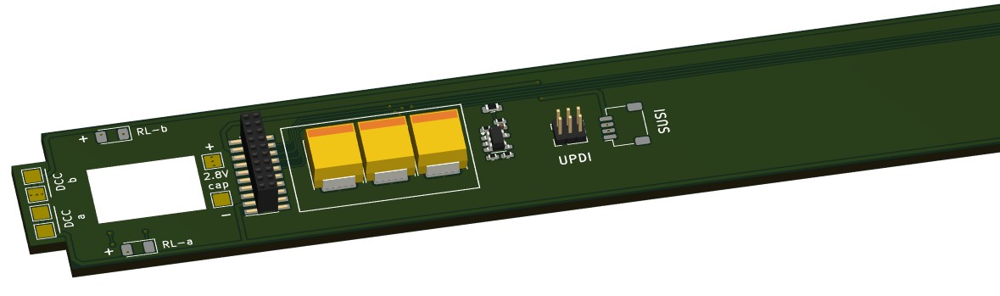
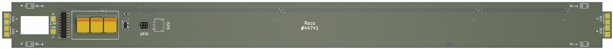
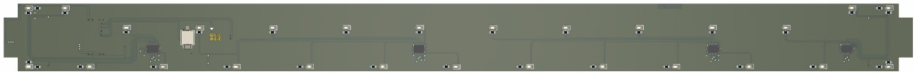

# LEDbase: Roco #44741

My Homebrew RTB D99 is an advanced, open-source decoder core (AVR64DA48) designed for serious modelers. It provides individual, high-density control for up to 32 LEDs and 4 auxiliary ports. More than just control, this core is engineered for ultimate reliability:
- **Flicker-Free Power:** Includes charging logic for external Polymer or Supercapacitors for robust power backup.
- **Real-Time Diagnostics:** Harness the power of Railcom DYN to transmit vital data, including Quality of Service (QoS), track voltage, and temperature, back to your central station.
- **DIY High-Density:** Fully open-source KiCad design (4-layer PCB) ready for reflow assembly.

 

> [!CAUTION]
> This project is **work in progress** and there may be (hope not) changes to the overall design if the current turns out to be not practical.

 

 

## Decoder features
- **DCC**
  - DCC-A automatic logon
  - DCC-R protocol extension
  - Service Mode Programming
- **Railcom**
  - Channel 1/2
  - POM, xPOM
  - DYN: QoS, Track-Voltage, Scap-Voltage, Temp, Ambient light
- **AUX ports**
  - 4 AUX ports (3.3V logic level)
  - AUX ports my be used for Servo
- **LED ports**
  - designed for 74HC595 shift register usage
  - allows up to 32 individual LEDs
- SUSI 3.3V
- 2.8V SCAP (optional, external to PCB)
- 16V Polymer Caps (optional, external to PCB)
- Inrush limited
- max track voltage 25V
- CPU heartbeat LED
- ambient light sensor (optional)
- fast firmware update within seconds on main tracks via DCC-R

# Hardware
The current PCB layout uses SMD footprints with 0.4mm pitch and mainly 0402 parts. Reflow soldering is mandatory.
The layout has been optimized to automatic PCB assembly.

## PCB
- 2-layer PCB, FR4, 1mm
- CPU: none

Details

## Kicad
[Schematic](doc/D99a_schematic.pdf) | [Layout](doc/D99a_layout.pdf) | [Gerber](gerber)

Dependency

 

:yellow_circle: Requires my Kicad project library [RTB_SamacSys](https://github.com/git4dcc/RTB_SamacSys) in the same directory tree.

This project is intended for hobby use only and is distributed in accordance with the Apache License 2.0 agreement.
