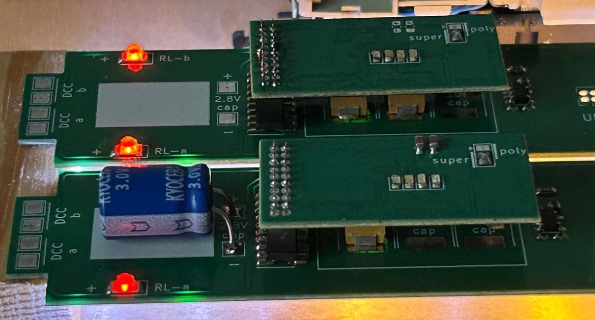
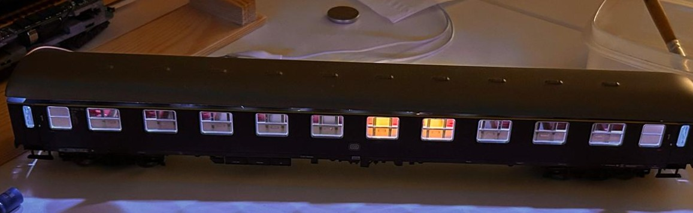
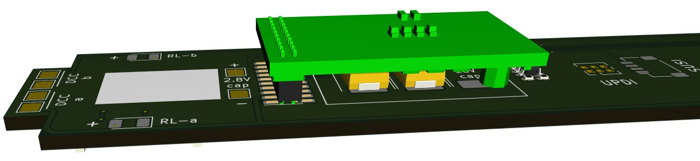

# LEDbase: Roco #44741

LED base carier for H0 Roco #44741 to be used with RTB_D99.
PCB contains LEDs for ilse, cabin and lavatory. In addition, external tail light LEDs can be attached on each end.

 

> [!CAUTION]
> This project is **work in progress** and there may be (hope not) changes to the overall design if the current turns out to be not practical.

 

 

## LED base features
- **LED ports**
  - 4x 74HC595 shift register
  - 31 individual LEDs
- SUSI 3.3V
- 2.8V SCAP (optional)
- 16V Polymer Caps (optional)
- ambient light sensor (optional)

# Hardware
The current PCB layout uses SMD footprints. Reflow soldering is recommended.

## PCB
- 2-layer PCB, FR4, 1mm
- CPU: none

Details

## Kicad
[Schematic](doc/D99a_schematic.pdf) | [Layout](doc/D99a_layout.pdf) | [Gerber](gerber)

:yellow_circle: Requires my Kicad project library [RTB_SamacSys](https://github.com/git4dcc/RTB_SamacSys) in the same directory tree.

# Images
 

This project is intended for hobby use only and is distributed in accordance with the Apache License 2.0 agreement.
